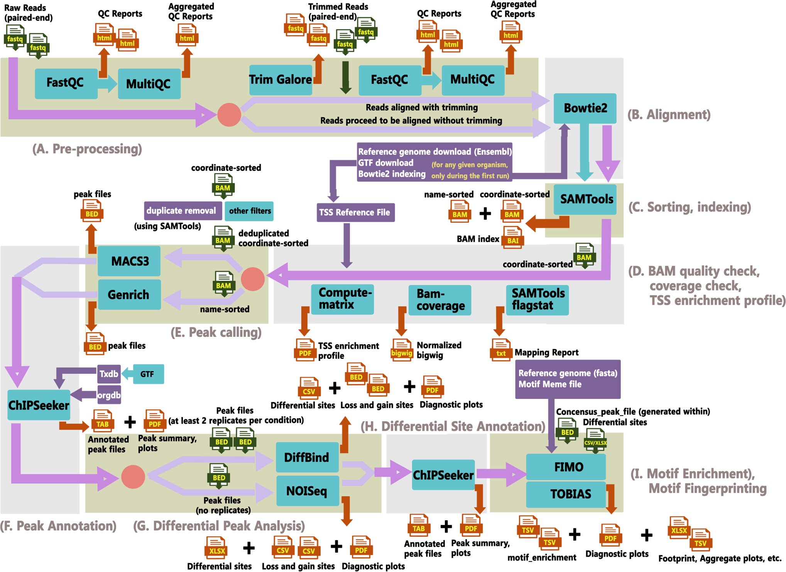

<div style="display: flex; align-items: center;">
  
<div>


  
# **ChromAcS**

> **An Automated, Flexible GUI for End-to-End Reproducible ATAC-seq Analysis Across Multiple Species**

[](LICENSE)


[](https://github.com/epigen-bioinfolab/CHROMACS/releases)

  </div>
</div>


## About

ChromAcS (***Chrom***atin ***Ac***cessibility Analysis ***S***uite) provides a streamlined, GUI-based workflow for analyzing ATAC-seq data. Shown below are the major analysis steps which have been incorporated with several related dependencies in a hierarchical and modular manner designed for the best user experience and easy navigation:

<p align="center">
  
</p>


ChromAcS-AddOn
- Peak Overlap and Expression Data Overlap  (`BEDTools`) ==> provided as a separate add-on (chromacs-addon), this utility overlaps user-supplied BED files with ChromAcS peak results to identify shared genomic regions. It also integrates expression data (e.g., RNA-seq) by matching identifiers, enabling the user to relate chromatin accessibility peaks to gene expression profiles.


Designed to assist both beginners and experienced users in analyzing chromatin accessibility with minimal command-line usage

#### Features

- **User-friendly GUI** — run ATAC-seq analysis without coding.
- **Complete pipeline** — from raw FASTQ to peak calling, QC, differential analysis, motif enrichment and footprinting, expression data integration, and so on.
- **Multi-species support** — human, mouse, yeast, and more.
- **Reproducible** — environment setup with Conda for consistency.
- **Fast installation** — automated setup scripts and manual for Windows, Mac, and Linux.
- **Customizable** — users can tweak parameters easily.
- **Open-source** — will always be free and accessible for the community.


## Documentation

[Download ChromAcS User Manual (PDF)](https://github.com/epigen-bioinfolab/CHROMACS/blob/main/User_Manual.pdf)


## Pre-requisites

Before installing ChromAcS, ensure you have the following:

- **For Windows users:** [Windows Subsystem for Linux (Ubuntu)](https://learn.microsoft.com/en-us/windows/wsl/install)
  
- **For Linux users:** ChromAcS Tested on [Ubuntu](https://ubuntu.com/download) and [Fedora](https://getfedora.org/); Other Linux/Mac users may need to install dependent tools from the source. For Mac users, an automated installer will be released soon
  
- **Git (optional):** [Install Git](https://git-scm.com/book/en/v2/Getting-Started-Installing-Git)
  
- **Conda:** [Install Conda](https://docs.conda.io/projects/conda/en/latest/user-guide/install/index.html)

## Installation
### Option 1 (Step-by-setp installation)
#### Step 1: Clone the repository (Recommended) :
```bash
git clone https://github.com/epigen-bioinfolab/CHROMACS.git
cd CHROMACS
```

#### Step 1 (alternate): Download as ZIP
If you download the zip file from the repository, ensure to avoid the above step

1. Go to https://github.com/epigen-bioinfolab/CHROMACS
2. Click the green Code button → Download ZIP
3. Extract the ZIP file.
The folder will be named CHROMACS-main. (Using Linux terminal command) Configure to the CHROMACS-main
```bash
cd CHROMACS-main
```

#### Step 2: Create and activate the environment :
```bash
conda env create -f environment.yml
conda activate chromacs
```

#### Step 3: Install the package :
```bash
pip install .
```

#### Step 4: Launch the application :
```bash
chromacs
```

#### Step 4a (Add-on): Launch the ChromAcS-AddOn: Additional Analysis Toolkit :
```bash
chromacs-addon
```

### Option 2 (automated single click installation)

#### Windows 11 (with WSL + Ubuntu)
1. [Download Installer](https://raw.githubusercontent.com/epigen-bioinfolab/CHROMACS/main/Install/ChromAcS-Install-Win11.zip)
2. Unzip the file.
3. Inside the folder `ChromAcS-Install-Win11`, double-click `ChromAcS-Install.bat`.
Once complete, launch by typing the following command in the (Linux: e.g. Ubuntu) terminal.
```bash
conda activate chromacs

chromacs        
chromacs-addon  
```
#### Ubuntu Linux (x86-64 / AMD64)
1. [Download Installer](https://raw.githubusercontent.com/epigen-bioinfolab/CHROMACS/main/Install/ChromAcS-Install-Ubuntu.zip) 
2. Unzip the file.
3. Inside the unzipped folder `ChromAcS-Install-Ubuntu`, open a terminal and run:
```bash
chmod +x INSTALL_CHROMACS.sh
./INSTALL_CHROMACS.sh
```
Run the following command to verify installation:
```bash
chmod +x chromacs-sanity-check.sh
./chromacs-sanity-check.sh
```
If any package is missing, the script will report it. You can install these manually or use Option 1 for automatic installation.

Alternative GUI-Based Install:
1. After unzipping, open your `File Manager`.
2. In the top menu bar, click the ☰ (three lines) icon. Select `Preferences`.
3. Go to the `Behavior` tab.
4. Under `Executable Text Files`, select `Ask each time`.
5. Double-click `ChromAcS-Install-Linux.sh`. Choose `Run in Terminal`.

Once complete, launch by typing the following command in the terminal.
```bash
chromacs        
chromacs-addon  
```

#### Fedora Linux (x86-64 / AMD64)
1. [Download Installer](https://raw.githubusercontent.com/epigen-bioinfolab/CHROMACS/main/Install/ChromAcS_Install_Fedora.zip)
2. Unzip the file.
3. Inside the folder `ChromAcS_Install_Fedora`, run the following command in terminal.
```bash
chmod +x INSTALL_CHROMACS_LINUX.sh
./INSTALL_CHROMACS_LINUX.sh
```
Once complete, launch by typing the following command in the terminal:
```bash
chromacs        
chromacs-addon  
```
#### macOS (ARM64 / Apple Silicon)
1. [Download Installer](https://raw.githubusercontent.com/epigen-bioinfolab/CHROMACS/main/Install/ChromAcS-Install-Mac.zip)
2. Unzip the file.
3. Main installation-
3a. Inside the folder `ChromAcS-Install-Mac`, double-click `ChromAcS-Install-MacOS.command`.
3b. Alternaternatively,right click on the `INSTALL_CHROMACS.sh`  file and select `Open in Terminal`
4. Once complete, launch by typing the following command in the terminal.
```bash
chromacs        
chromacs-addon  
```
*NOTE*
If you get "Apple cannot verify this app" warning, go to `System Preferences` → `Security & Privacy` → `General`.  Then  click on  `Open Anyway` button next to the warning message.

Otherwise, you can right-click on `ChromAcS-Install-MacOS.command`, select  `Open` from the menu, and click `Open` in the appeared security dialog.

## Test Data

The following public FASTQ datasets are used for demonstration and testing of this pipeline.

### Baseline Samples
| Sample | Read 1 | Read 2 |
|:--------|:-------|:-------|
| SRR5800658 | [R1](https://ftp.sra.ebi.ac.uk/vol1/fastq/SRR580/008/SRR5800658/SRR5800658_1.fastq.gz) | [R2](https://ftp.sra.ebi.ac.uk/vol1/fastq/SRR580/008/SRR5800658/SRR5800658_2.fastq.gz) |
| SRR5800657 | [R1](https://ftp.sra.ebi.ac.uk/vol1/fastq/SRR580/007/SRR5800657/SRR5800657_1.fastq.gz) | [R2](https://ftp.sra.ebi.ac.uk/vol1/fastq/SRR580/007/SRR5800657/SRR5800657_2.fastq.gz) |
| SRR5800659 | [R1](https://ftp.sra.ebi.ac.uk/vol1/fastq/SRR580/009/SRR5800659/SRR5800659_1.fastq.gz) | [R2](https://ftp.sra.ebi.ac.uk/vol1/fastq/SRR580/009/SRR5800659/SRR5800659_2.fastq.gz) |

### Test Samples
| Sample | Read 1 | Read 2 |
|:--------|:-------|:-------|
| SRR5800661 | [R1](https://ftp.sra.ebi.ac.uk/vol1/fastq/SRR580/001/SRR5800661/SRR5800661_1.fastq.gz) | [R2](https://ftp.sra.ebi.ac.uk/vol1/fastq/SRR580/001/SRR5800661/SRR5800661_2.fastq.gz) |
| SRR5800660 | [R1](https://ftp.sra.ebi.ac.uk/vol1/fastq/SRR580/000/SRR5800660/SRR5800660_1.fastq.gz) | [R2](https://ftp.sra.ebi.ac.uk/vol1/fastq/SRR580/000/SRR5800660/SRR5800660_2.fastq.gz) |
| SRR5800662 | [R1](https://ftp.sra.ebi.ac.uk/vol1/fastq/SRR580/002/SRR5800662/SRR5800662_1.fastq.gz) | [R2](https://ftp.sra.ebi.ac.uk/vol1/fastq/SRR580/002/SRR5800662/SRR5800662_2.fastq.gz) |

### Technical Controls
| Sample | Read 1 | Read 2 |
|:--------|:-------|:-------|
| SRR2927084 | [R1](https://ftp.sra.ebi.ac.uk/vol1/fastq/SRR292/004/SRR2927084/SRR2927084_1.fastq.gz) | [R2](https://ftp.sra.ebi.ac.uk/vol1/fastq/SRR292/004/SRR2927084/SRR2927084_2.fastq.gz) |
| SRR2927085 | [R1](https://ftp.sra.ebi.ac.uk/vol1/fastq/SRR292/005/SRR2927085/SRR2927085_1.fastq.gz) | [R2](https://ftp.sra.ebi.ac.uk/vol1/fastq/SRR292/005/SRR2927085/SRR2927085_2.fastq.gz) |

*These datasets are publicly available from the European Nucleotide Archive (ENA) and correspond to ATAC-seq baseline, test, and control samples. There are three replicates in the baseline and test samples. For an elaborate metadata, please view the test_data_links folder.*


## Contact

For any queries and support, please reach us at **epigen.bioinfolab@gmail.com**  
Visit our lab page: [www.epigen-bioinfolab.com](https://www.epigen-bioinfolab.com/)

## Stay Updated 
We occasionally release updates to ChromAcS dependencies and features. 
👉 [Subscribe Free for ChromAcS Updates](https://epigen-bioinfolab.github.io/CHROMACS/) 

## Acknowledgements

- FastQC, MultiQC, Trim Galore, bowtie2, MACS3, Genrich, ChIPseeker, DiffBind, NOISeq, deepTools, MEME Suite, TOBIAS; along with their dependencies
- Bioconda, Conda-Forge community, Python Software Foundation and the Python community.

## License
This project is licensed under the MIT License - see the [LICENSE](LICENSE) file for details.
